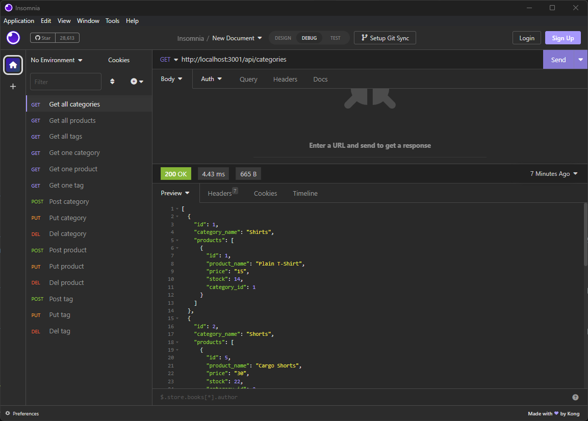
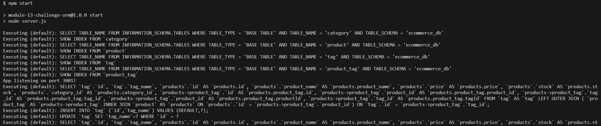

# E-Commerce Backend

## Description

This is a backend for an E-commerce back end. It has a database for products that are mapped to categories and tags. There are api routes to perform RESTful CRUD operations with the ability to create, update, and delete objects in the database.

## Screenshot

## Link

GitHub Repo:
https://github.com/auswaller/e-commerce-backend

Video Walkthrough:
https://drive.google.com/file/d/1nWyIvexU2nYib8_mgYWqjzBdJdsl8A-p/view